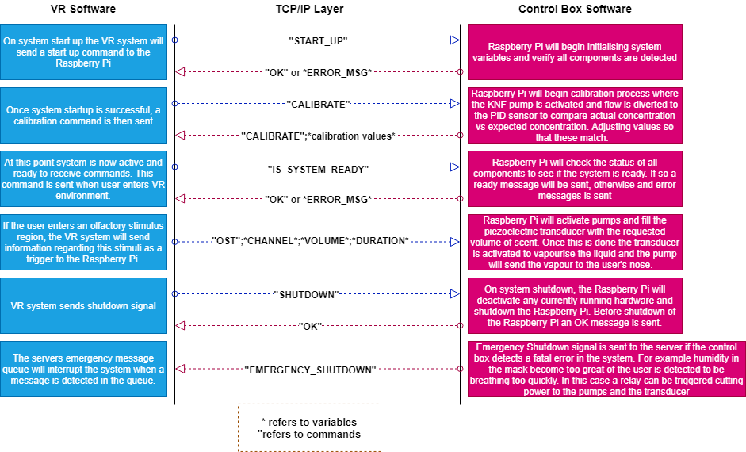

# A multimodal VR maze for behavioural experiments
# Summary
#### This repository will contain the all the software being developed as part of this project.
## Overall System Diagram

## Software Diagram

## Network Diagram

# Software Design Objectives
Make software as modular as possible. Please make use of interfaces and abstraction available to languages such as ~~Java~~ Python and C#.
# Software Objectives - when met please tick the boxes
- [x] Create a tool by which the user can generate and customise their own maze configurations.
- [x] Find a way of triggering and showing different stimuli in the maze. (e.g. Odour, Visual and or Acoustic)
- [x] Solve the synchronisation and latency issues 
- [x] Modify or create new software for the control box using the raspberry PI 4 platform. Using Java (e.g. PI4J library) for example to create an embedded system.and area, making it more realistic.

#### Completed work (Includes Sprints 1 & 2):
* Maze Generation Tool Part 4 - Add stimulus area tool
* Develop compatibility layer for legacy midi control
* Deploy Unity application to VR headset.
* Maze Generation Tool Part 4 - Add visual stimuli pop up additions.
* Network latency testing (includes trigger testing)
* Create trigger mechanism (Asynchronous background listeners)
* Create and format messages to be sent between the server and client, containing information on what channel to activate and for how long.
* TCP/UDP Server Development - create a TCP and or UDP server software
* Maze Generation Tool Part 1 - tool used to create new mazes and insert locations and behaviour of new stimuli
* New Stimulus Integration Part 1 - Insert new stimuli into maze, starting with visual
* Maze Generation Tool Part 2 - tool has been updated to generate JSON strings 
* New Stimulus Integration Part 2 - new maze parser loads JSON strings and loads in stimuli
* Maze Generation Tool Part 3 - Maze editing tools features for creating and deleting walls in the tool.
* Network latency in TCP/UDP connection
* Software to parse ASCII maze and JSON string to generate the data needed to render the 3D maze.
* implemented audio stimuli
* implemented olfactory stimuli
* Create stimulus pop ups for visual stimuli
* Create Initial GPIO software using PI4J libraries - create some software to control a pump or other hardware, only needs to be simple for now
* PI4J Research for GPIO Software development - in depth research on the PI4J Libraries
* Add an ADC chip to the raspberry pi, this will be used for reading sensor values. -- planning to order MCP3008 ADC for Pi --update: using ADS1115 chip instead for higher resolution (16 bit)
* create schematics for the raspberry pi and adc, then order the components and create the circuit.
* Go through research regarding the effects of coffee to reset the odour stimulus
#### Sprint 3:
* **Created a system diagram incorporating flow and electronics** - 02/02/20
* **Conducted breathing circuit experiments, using KNF pump at maximum voltage** - conducted by the end of Jan 2020

# Completed Sprints
### Sprint 1 - 02/11/2019
### General
* Create List of commands that will interchange between server and client software (e.g. TURN_ON_PUMP)
* TCP/UDP Server Development - create a TCP and or UDP server software
* Maze Generation Tool Part 1 - tool used to create new mazes and insert locations and behaviour of new stimuli
* New Stimulus Integration Part 1 - Insert new stimuli into maze, starting with visual
* Network latency in TCP/UDP connection
* Unity Software Research - general research around Unity
* TCP/UDP Client Development - create a TCP and or UDP client software
* Develop Concurrent Java Platform Part 1
* Go through research regarding the effects of coffee to reset the odour stimulus.
* Network latency testing (includes trigger testing)
* Create trigger mechanism (Asynchronous backgroud listeners)
* Create and format messages to be sent between the server and client, containing information on what channel to activate and for how long.
* TCP/UDP Server Development - create a TCP and or UDP server software
* Maze Generation Tool Part 1 - tool used to create new mazes and insert locations and behaviour of new stimuli
* New Stimulus Integration Part 1 - Insert new stimuli into maze, starting with visual
* Network latency in TCP/UDP connection
* Software to parse ASCII maze and JSON string to generate the data needed to render the 3D maze.
* Create Initial GPIO software using PI4J libraries - create some software to control a pump or other hardware, only needs to be simple for now
* PI4J Research for GPIO Software development - in depth research on the PI4J Libraries
* Add an ADC chip to the raspberry pi, this will be used for reading sensor values. -- planning to order MCP3008 ADC for Pi --update: using ADS1115 chip instead for higher resolution (16 bit)
* Create schematics for the Raspberry Pi and ADC, then order the components and create the circuit.

# Meeting notes 09/10/2019
* Flushing system in the mask, this is designed to evacuate the odour in the mask to avoid desensitisation, coating inside mask to prevent sticking.
* Introduce a "reset" odour such as coffee.
* Software vs Hardware PID.
* Synchronisation, latency between commands being sent to the device.
* Develop experimental tests.
* Preemptive triggers depending on user speed within the maze taking into account the latency.

# Literature Review
* https://www.ncbi.nlm.nih.gov/pmc/articles/PMC4101573/
* https://www.research.manchester.ac.uk/portal/files/54510179/FULL_TEXT.PDF
* https://www.researchgate.net/post/Which_has_better_performance_and_speed_Hardware_PID_or_a_software-programmed_PID
* https://www.researchgate.net/publication/308946315_Driving_frequency_optimization_of_a_piezoelectric_transducer_and_the_power_supply_development
* https://www.researchgate.net/publication/329256385_Lotus_enhancing_the_immersive_experience_in_virtual_environment_with_mist-based_olfactory_display
* https://www.academia.edu/36939722/Real_Time_Respiration_Rate_Measurement_Using_Temperature_Sensor?auto=download
* https://my.clevelandclinic.org/health/articles/10881-vital-signs

# Resources
## Dependencies
* https://github.com/google/gson
* https://nugetmusthaves.com/Package/Melanchall.DryWetMidi

## General
* https://pypi.org/project/tcp-latency/
* https://processing.org/reference/environment/
* https://github.com/tekdemo/MiniPID-Java
* https://www.midassensors.com/getattachment/d321edce-cc98-4b4a-8d9f-98055e862f16/Immersible-atomiser-driver-circuit
* https://www.youtube.com/watch?v=yE0JdtVTnVk - audio on collision
* https://developer.oculus.com/documentation/unity/latest/concepts/unity-build-pc/ - unity build
* https://melanchall.github.io/drywetmidi/#documentation - Unity MiDi help
* https://github.com/ferbar/raspberry_ads1256_dac8552 --waveshare ADAC resources, may come in handy
* https://docs.microsoft.com/en-us/visualstudio/cross-platform/unity-scripting-upgrade?view=vs-2019 -- addings nuget packages to unity
* https://www.petervis.com/electronics/Voltage_Regulator_Heatsink/Heatsink_for_TO-220_Voltage_Regulator.html

## Raspberry Pi Resources
* https://calpilot.wordpress.com/2014/05/11/raspberry-pi-and-pi4j-tutorial-1/
* https://github.com/Pi4J/pi4j/blob/master/pi4j-example/src/main/java/MCP3008GpioExample.java - MCP3008 ADC code
* https://learn.adafruit.com/raspberry-pi-analog-to-digital-converters/ads1015-slash-ads1115 - ADS1115 help
* https://learn.adafruit.com/adafruit-4-channel-adc-breakouts/overview -- ADC Code
* https://pi4j.com/1.2/pins/model-3b-rev1.html
* https://www.admfactory.com/blinking-led-on-raspberry-pi-using-java/
* https://www.raspberrypi-spy.co.uk/2016/07/using-bme280-i2c-temperature-pressure-sensor-in-python/ - raspberry pi GY-BME280 setup
* https://www.youtube.com/watch?v=LUbhPKBL_IU - stepper motor setup and code
* https://www.webucator.com/blog/2015/08/python-clocks-explained/
* https://raspberrypi.stackexchange.com/questions/1433/how-can-i-generate-frequency-pulse-signals --raspberry pi signal generator
* https://www.youtube.com/watch?v=Zjr69DxgeW0 - gpio pwm settings

## Debugging Help
* https://www.raspberrypi.org/forums/viewtopic.php?f=34&t=23239
